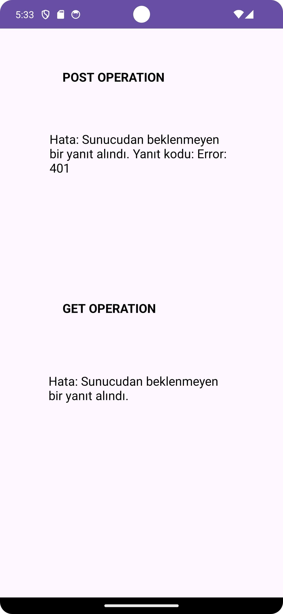
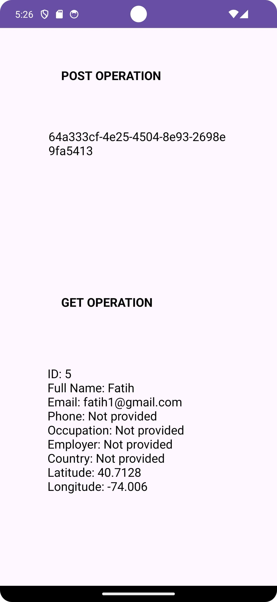

# Patika Bootcamp Week 4 Assignment: Espresso Food Delivery Android App

This Android application is developed as part of the Patika.dev Android Bootcamp Week 4 assignment. The objective was to implement API service methods for user login (POST) and fetching user profile (GET) without using Retrofit or any third-party libraries.

## Assignment Requirements:
- Implement a login functionality using POST method.
- Implement fetching user profile using GET method.
- Do not use any third-party libraries.

## Implementation Details:
- Implemented the login functionality using HttpURLConnection to make a POST request to the API endpoint.
- Implemented fetching user profile functionality using HttpURLConnection to make a GET request to the API endpoint.
- Added error handling to gracefully handle network errors, server errors, and unexpected responses.
- Used Kotlin Coroutines for asynchronous network requests to avoid blocking the main UI thread.
- Designed a simple user interface with two TextViews to display the response of login and profile requests.
- Utilized Harun Hoca's demonstration from last week's class as a reference for UI design, featuring a clean and minimalist layout.
- Implemented separation of concerns

## How to Run:
1. Clone or download the project from the GitHub repository.
2. Import the project into Android Studio.
3. Build and run the application on an Android device or emulator.

## Screenshots:

## Screenshots

## Feedback and Contributions:
Feedback, suggestions, and contributions are welcome. Feel free to open an issue or submit a pull request.

